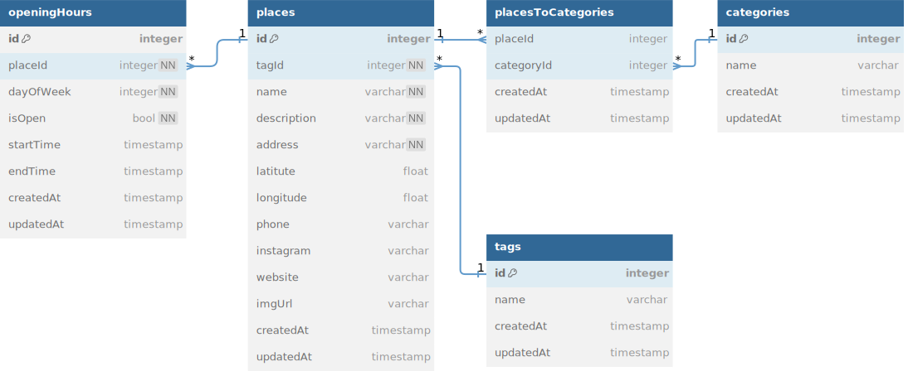

# Jogjalan

Jogjalan API for listing various tourism destinatios, restaurants, and todos in Yogyakarta.

## Tech Stacks

- [Bun](https://bun.sh/)
- [Hono](https://hono.dev/)
- [Typescript](https://www.typescriptlang.org/)
- [Prisma](https://www.prisma.io/)

## REST API Specification

- Production: <https://jogjalan.budigunawan.com>
- Local: <http://localhost:3000>

| Endpoint      | HTTP     | Description            |
| ------------- | -------- | ---------------------- |
| `/places`     | `GET`    | Get all places         |
| `/places/:id` | `GET`    | Get one place by id    |
| `/places`     | `POST`   | Add new place          |
| `/places`     | `DELETE` | Delete all places      |
| `/places/:id` | `DELETE` | Delete one place by id |
| `/places/:id` | `PUT`    | Update one place by id |

## Database Design/Schema/ERD



## Getting Started

To install dependencies:

```sh
bun install
```

To run:

```sh
bun run dev

#  OR

bun dev
```

Open <http://localhost:3000>
